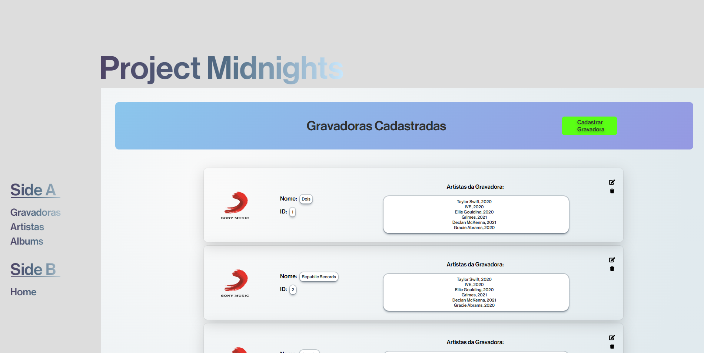

# Project Midnights (Front-end)

Este é o repositório Front-end para um sistema de controle de cadastro de Gravadoras e seus artistas e albuns. Foi desenvolvido como o projeto final durante a disciplina PPWI4 (Programação para Web) para minha faculdade.

Este projeto consome o Back-end realizado em Java, clicando aqui você pode visualizar o [repositório](https://github.com/jonathabot/projectmidnights).

## **Stack**

- Java (**SpringBoot**)
- JavaScript (**ReactJS**)

## **Pacotes**

- React-Router-Dom
- React-Hook-Form
- React-Icons
- Axios

## Preview

**PROJETO EM ANDAMENTO**

Design foi inspirado na capa do álbum [Midnights](https://pt.wikipedia.org/wiki/Midnights).
